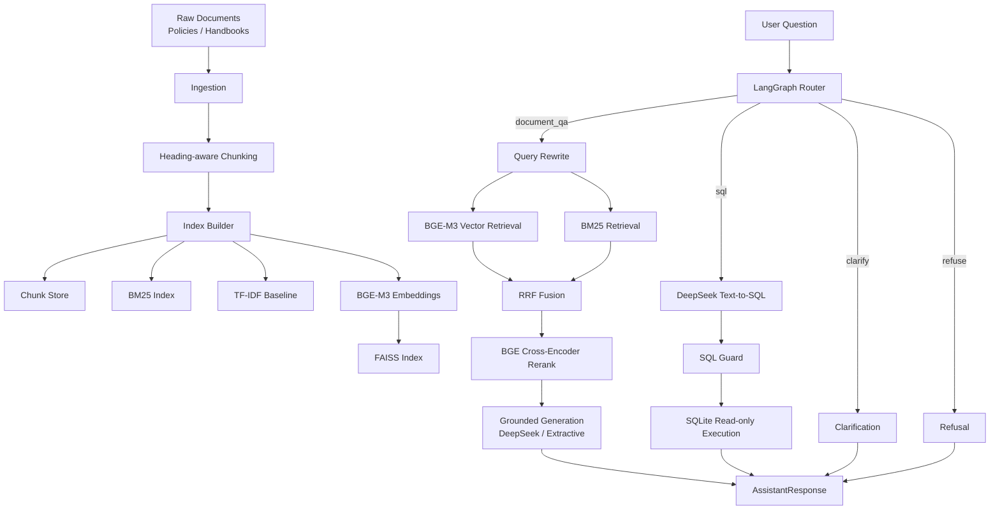

# Enterprise Knowledge Assistant

Enterprise Knowledge Assistant is a controllable enterprise RAG system built with LangGraph, BGE-M3 embeddings, BM25 hybrid retrieval, BGE cross-encoder reranking, DeepSeek generation, guarded Text-to-SQL, citations, refusal handling, and offline evaluation.

The project is designed as a resume-grade engineering prototype rather than a toy chat demo. Its main pattern is:

```text
controlled workflow + local agentic decisions
```

LangGraph controls routing and execution boundaries, while specialized modules handle retrieval, reranking, grounded generation, SQL generation, SQL safety checks, memory, and evaluation.

## Highlights

- **BGE-M3 vector retrieval** with FAISS.
- **BM25 keyword retrieval** for exact policy terms, numbers, departments, and status values.
- **RRF fusion** between vector and lexical retrieval.
- **BGE cross-encoder rerank** with `BAAI/bge-reranker-v2-m3`.
- **LangGraph workflow routing** for document QA, SQL, clarification, and refusal.
- **DeepSeek generation** through an OpenAI-compatible API.
- **Extractive fallback** so the system runs without external LLM keys.
- **Guarded Text-to-SQL** with DeepSeek, SQLite, and a strict SQL guard.
- **Citation tracing** with document name, heading path, source type, URL, and chunk id.
- **Grounding checks** for unsupported numbers, citation precision, and lexical support.
- **Offline evaluation** with retrieval hit@k, MRR, route accuracy, refusal hit rate, and answer term matching.
- **Streamlit UI** for chat, evidence inspection, workflow trace, and evaluation.
- **FastAPI endpoint** for programmatic use.

## Architecture



## Tech Stack

| Area | Technology |
| --- | --- |
| Workflow | LangGraph |
| Data models | Pydantic |
| Embedding | `BAAI/bge-m3` |
| Vector index | FAISS |
| Lexical retrieval | BM25 via `rank-bm25` |
| Baseline retrieval | TF-IDF via scikit-learn |
| Fusion | Reciprocal Rank Fusion |
| Rerank | `BAAI/bge-reranker-v2-m3` CrossEncoder |
| LLM | DeepSeek OpenAI-compatible API |
| SQL | SQLite + guarded Text-to-SQL |
| API | FastAPI / Uvicorn |
| UI | Streamlit |
| CLI | Typer |
| Environment | conda + uv |

## Repository Layout

```text
enterprise-knowledge-assistant/
  apps/
    streamlit_app.py
  config/
    default.yaml
  data/
    raw/                  # Small demo policy documents
    eval/                 # Lightweight eval set
  docs/
    technical_report.md   # Detailed Chinese technical report
  reports/
    eval_compare.md
    eval_report.md
  scripts/
    fetch_handbooks.py
    prepare_handbooks.py
  src/eka/
    api.py
    chunking.py
    cli.py
    doctor.py
    embeddings.py
    evaluation.py
    generation.py
    grounding.py
    indexing.py
    ingestion.py
    memory.py
    rerank.py
    retrieval.py
    router.py
    schemas.py
    settings.py
    sql_agent.py
    sql_guard.py
    sql_tool.py
```

## Quick Start

The original development environment uses a conda environment named `cs336-a5`, but any Python environment supported by `uv` can be used.

```bash
git clone https://github.com/JohnClare5/Enterprise-Knowledge-Assistant.git
cd Enterprise-Knowledge-Assistant

export HF_ENDPOINT=https://hf-mirror.com
export UV_LINK_MODE=copy

uv sync
uv run eka init-data
uv run eka build-index
uv run eka ask "实习生住宿标准是多少？" --strategy vector_bm25_rerank
uv run eka doctor
```

## Build BGE-M3 / FAISS Index

The repository does not include model weights or binary indexes. Download models and build the vector index locally:

```bash
export HF_ENDPOINT=https://hf-mirror.com
uv run eka build-index --with-embeddings
uv run eka doctor
```

Expected doctor output includes:

```json
{
  "embedding": {
    "faiss_index_exists": true,
    "manifest_exists": true,
    "manifest": {
      "model_name": "BAAI/bge-m3",
      "dimension": 1024,
      "normalize_embeddings": true
    }
  }
}
```

## DeepSeek Configuration

Copy `.env.example` to `.env` and fill in your own API key:

```bash
cp .env.example .env
```

```text
EKA_GENERATION_MODE=deepseek
DEEPSEEK_API_KEY=your_deepseek_api_key_here
DEEPSEEK_BASE_URL=https://api.deepseek.com
DEEPSEEK_MODEL=deepseek-chat
```

Then run:

```bash
uv run eka ask "实习生住宿标准是多少？" \
  --strategy vector_bm25_rerank \
  --generation deepseek
```

Do not commit `.env`, API keys, model weights, FAISS indexes, SQLite files, or HuggingFace caches.

## Retrieval Strategies

Supported strategies:

```text
bm25
tfidf
hybrid
hybrid_rerank
vector
vector_bm25
vector_bm25_rerank
```

The default production-style strategy is:

```text
vector_bm25_rerank
```

This means:

```text
BGE-M3 vector retrieval + BM25 + RRF + BGE cross-encoder rerank
```

If FAISS or the reranker is unavailable, the system falls back to lighter retrieval/reranking modes and records the reason in `trace`.

## Guarded Text-to-SQL

For structured business questions, the SQL branch uses DeepSeek to generate SQL JSON, then validates it with `sql_guard.py`.

The guard enforces:

- Only one statement.
- Only `SELECT`.
- No `INSERT`, `UPDATE`, `DELETE`, `DROP`, `ALTER`, `CREATE`, or similar destructive operations.
- Only whitelisted tables:
  - `reimbursement_records`
  - `sales_summary`
  - `project_status`
- Automatic `LIMIT` insertion when missing.

Example:

```bash
uv run eka ask "上个月销售额最高的是哪个区域？"
```

## Evaluation

Run a single strategy:

```bash
uv run eka eval --strategy vector_bm25_rerank
```

Compare multiple retrieval strategies:

```bash
uv run eka eval-compare \
  --strategies bm25,tfidf,hybrid,hybrid_rerank,vector,vector_bm25,vector_bm25_rerank
```

Reports are written to:

```text
reports/eval_report.md
reports/eval_compare.md
```

Metrics include:

- route accuracy
- retrieval hit@k
- MRR
- citation rate
- refusal hit rate
- expected answer term match

## Streamlit UI

```bash
uv run streamlit run apps/streamlit_app.py \
  --server.address 0.0.0.0 \
  --server.port 8501
```

The UI supports:

- Retrieval strategy selection.
- Generation mode selection.
- Answer and citation display.
- Retrieved evidence inspection.
- Workflow trace inspection.
- Offline evaluation comparison.

## FastAPI

```bash
uv run uvicorn eka.api:app --host 0.0.0.0 --port 8000
```

Endpoints:

- `GET /health`
- `POST /ask`

## Public Data Ingestion

The project includes scripts for fetching public handbook data. If GitHub is blocked on your server, the configured proxy prefix is used:

```text
https://gh.llkk.cc/
```

```bash
uv run python scripts/fetch_handbooks.py --name gitlab_handbook --limit 200
uv run python scripts/fetch_handbooks.py --name sourcegraph_handbook --limit 200
uv run python scripts/prepare_handbooks.py --limit 300 --min-chars 500
uv run eka build-index --with-embeddings
```

Large cloned handbook directories are intentionally ignored by git.

## Documentation

A detailed Chinese technical report is available at:

```text
docs/technical_report.md
```

It covers architecture, data flow, BGE-M3 embeddings, FAISS, BM25, RRF, CrossEncoder reranking, LangGraph routing, DeepSeek generation, Text-to-SQL, SQL guard, grounding checks, evaluation, and deployment.

## Security Notes

- Never commit `.env`.
- Never commit DeepSeek/OpenAI API keys.
- Never commit model weights such as `.bin`, `.safetensors`, `.pt`, `.pth`.
- Never commit FAISS indexes or generated SQLite databases.
- Treat SQL generation as untrusted and always pass it through `SQL Guard`.

## License

MIT License.

