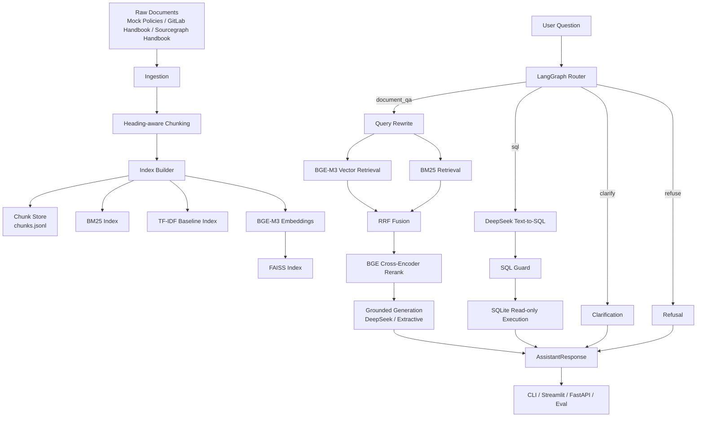
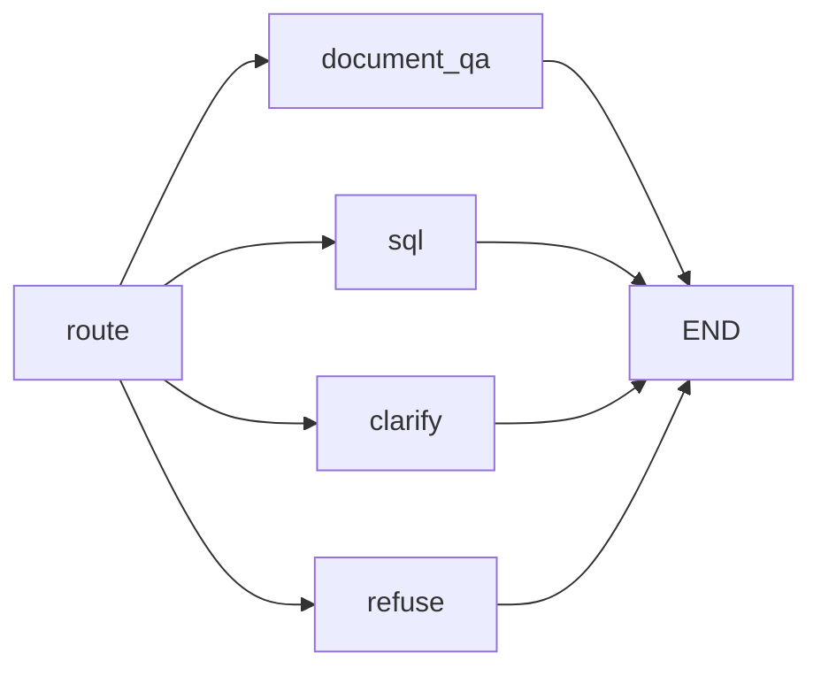

# 企业知识助手系统技术报告（最新迭代版）

## 1. 项目概述

本项目实现了一个面向企业制度、公开 handbook、FAQ 与少量结构化业务数据的企业知识助手系统。系统以 Retrieval-Augmented Generation（RAG）为主线，结合 LangGraph 受控工作流、BGE-M3 向量检索、BM25 关键词检索、RRF 融合、BGE Cross-Encoder Rerank、DeepSeek LLM 生成、受控 Text-to-SQL、SQLite 工具、引用溯源、拒答机制与离线评测，构建了一个可解释、可回退、可评测的企业问答原型。

当前系统的核心架构不再是简单 TF-IDF/BM25 demo，而是以 `BAAI/bge-m3` embedding 与 `BAAI/bge-reranker-v2-m3` cross-encoder reranker 为核心检索模块。TF-IDF 保留为轻量 baseline 与 fallback；主力在线检索策略为：

```text
vector_bm25_rerank = BGE-M3 Vector Retrieval + BM25 + RRF + BGE Cross-Encoder Rerank
```

项目强调企业问答场景中的稳定性和可解释性，因此没有采用开放式 autonomous agent，而是采用“受控 workflow + 局部智能决策”的设计：LangGraph 负责显式定义路由与执行分支，局部模块负责 query rewrite、retrieval、rerank、generation、SQL generation 和 grounding 校验。

远端工程目录：

```text
/lhy/LLM/enterprise-knowledge-assistant
```

本地工程目录：

```text
/Users/ocean/Workspace/projects/LLM/LangChain/enterprise-knowledge-assistant
```

## 2. 项目目标

系统面向模拟企业内部员工，支持以下任务：

- 企业制度、流程、研发规范、公开 handbook 的自然语言问答。
- 回答必须返回可追溯引用，包括文档名、章节路径、来源类型、URL 或本地来源。
- 支持多轮追问，通过轻量 query rewrite 继承上一轮主题。
- 支持 BGE-M3 向量检索与 BM25 关键词检索的混合召回。
- 支持 RRF 融合多路召回结果。
- 支持 BGE cross-encoder rerank 精排候选证据。
- 支持 DeepSeek LLM 基于证据生成回答。
- 支持无 LLM 时的 extractive fallback。
- 支持文档问答、SQL 查询、澄清、拒答四类路由。
- 支持 DeepSeek 受控 Text-to-SQL 和 SQL guard。
- 支持离线评测与多策略对比报告。
- 支持 Streamlit UI 展示 route、retrieval、rerank、generation、grounding trace。

项目边界：当前不实现复杂权限系统、多租户、在线增量索引、生产级数据库权限控制、消息队列或开放式 agent 自主行动。

## 3. 技术栈

| 模块 | 技术 | 作用 |
| --- | --- | --- |
| 工作流 | LangGraph | 定义 route / document_qa / sql / clarify / refuse 分支 |
| 数据结构 | Pydantic | 统一 RawDocument、Chunk、Evidence、Citation、AssistantResponse |
| Embedding | BAAI/bge-m3 | 主力中英混合语义向量模型 |
| 向量索引 | FAISS IndexFlatIP | 存储归一化 embedding，执行内积检索 |
| 关键词检索 | rank-bm25 | BM25 lexical retrieval |
| Baseline | scikit-learn TF-IDF | 轻量 baseline 与 fallback 检索 |
| 融合排序 | RRF | 融合 vector 与 BM25 排名 |
| 精排 | BAAI/bge-reranker-v2-m3 | Cross-Encoder rerank query-document pairs |
| 生成 | DeepSeek API | OpenAI-compatible grounded generation 与 Text-to-SQL |
| 生成 fallback | Extractive composer | 无 API 或 API 失败时抽取式回答 |
| 结构化查询 | SQLite | 模拟企业业务数据表 |
| SQL 安全 | 自定义 SQL Guard | 只允许白名单表的单条 SELECT |
| UI | Streamlit | 聊天、证据、trace、eval 页面 |
| API | FastAPI / Uvicorn | `/health` 与 `/ask` HTTP 接口 |
| CLI | Typer | init-data、build-index、ask、eval、eval-compare、doctor |
| 环境管理 | conda + uv | `cs336-a5` conda 环境 + 项目 `.venv` |

## 4. 总体架构

系统由五条链路组成：离线数据处理链路、离线索引构建链路、在线文档问答链路、结构化 SQL 查询链路、离线评测链路。



核心原则：所有分支最终都返回统一的 `AssistantResponse`，其中包含 answer、route_type、citations、retrieved_chunks、sql、raw_result、grounded、trace 等字段，便于 UI 展示、日志记录与离线评测。

## 5. 工程目录

```text
enterprise-knowledge-assistant/
  apps/
    streamlit_app.py
  config/
    default.yaml
  scripts/
    fetch_handbooks.py
    prepare_handbooks.py
  data/
    raw/
    structured/
    eval/
    indexes/
      chunks.jsonl
      bm25.pkl
      tfidf.pkl
      faiss.index
      embedding_manifest.json
  reports/
    eval_report.md
    eval_compare.md
  docs/
    technical_report.md
  src/eka/
    schemas.py
    settings.py
    ingestion.py
    chunking.py
    indexing.py
    embeddings.py
    retrieval.py
    rerank.py
    generation.py
    grounding.py
    router.py
    sql_agent.py
    sql_guard.py
    sql_tool.py
    memory.py
    evaluation.py
    doctor.py
    cli.py
    api.py
```

## 6. 数据源设计

### 6.1 Mock 企业制度文档

默认样例数据由 `src/eka/sample_data.py` 生成，覆盖：

- 差旅报销制度。
- 请假制度。
- 入职流程。
- 研发 Code Review 规范。
- GitLab Handbook 样例。
- Sourcegraph Handbook 样例。

这组 mock 文档用于快速演示系统能力和稳定复现评测。

### 6.2 公开 Handbook 数据

项目支持拉取 GitLab Handbook 与 Sourcegraph Handbook。考虑远端 GitHub 访问限制，clone URL 统一通过代理前缀：

```text
https://gh.llkk.cc/
```

拉取命令：

```bash
export HF_ENDPOINT=https://hf-mirror.com
uv run python scripts/fetch_handbooks.py --name gitlab_handbook --limit 200
uv run python scripts/fetch_handbooks.py --name sourcegraph_handbook --limit 200
uv run python scripts/prepare_handbooks.py --limit 300 --min-chars 500
```

`prepare_handbooks.py` 会过滤低价值 Markdown，例如过短文档、索引页、README、license、导航页等，并将准备后的文档写入：

```text
data/raw/prepared/gitlab_handbook
data/raw/prepared/sourcegraph_handbook
```

同时生成：

```text
data/raw/external_manifest.json
```

### 6.3 SQLite 结构化业务数据

`src/eka/sql_tool.py` 初始化三张模拟业务表：

- `reimbursement_records`
- `sales_summary`
- `project_status`

用于支持销售额、报销金额、项目状态等结构化查询。

## 7. 核心数据结构

### 7.1 Chunk

Chunk 是检索和引用的基础单位：

```python
class Chunk(BaseModel):
    chunk_id: str
    doc_id: str
    doc_name: str
    section: str
    source: str
    text: str
    metadata: dict[str, Any]
```

关键 metadata：

- `source_type`: mock_policy / gitlab_handbook / sourcegraph_handbook。
- `url`: 来源 URL 或本地相对路径。
- `heading_path`: Markdown 标题层级路径。
- `section_index`: 章节内 chunk 序号。

### 7.2 Evidence

Evidence 是检索返回的证据对象：

```python
class Evidence(BaseModel):
    chunk: Chunk
    score: float
    rank: int
    retrieval_method: str
```

### 7.3 AssistantResponse

系统统一输出：

```python
class AssistantResponse(BaseModel):
    answer: str
    route_type: RouteType
    citations: list[Citation]
    retrieved_chunks: list[Evidence]
    needs_clarification: bool
    refusal_reason: str | None
    confidence: float
    grounded: bool
    sql: str | None
    raw_result: Any | None
    trace: dict[str, Any]
```

统一响应结构是项目可解释性和可评测性的基础。

## 8. 文档处理与层级切块

`ingestion.py` 负责读取 Markdown / TXT 文档，识别 source_type 和 URL。

`chunking.py` 采用 heading-aware chunking，而不是纯固定长度切块。对于：

```text
# 差旅报销制度
  ## 实习生差旅标准
```

生成：

```text
差旅报销制度 > 实习生差旅标准
```

该 heading path 会进入 chunk metadata 和 citation 展示。层级切块的优势：

- 检索时标题可参与匹配。
- 生成时引用章节更准确。
- UI 可展示完整来源路径。
- 评测时可分析命中章节。

## 9. 索引构建

构建基础索引：

```bash
uv run eka init-data
uv run eka build-index
```

构建 BGE-M3 + FAISS 向量索引：

```bash
export HF_ENDPOINT=https://hf-mirror.com
uv run eka build-index --with-embeddings
```

索引产物：

```text
data/indexes/chunks.jsonl
data/indexes/bm25.pkl
data/indexes/tfidf.pkl
data/indexes/faiss.index
data/indexes/embedding_manifest.json
data/indexes/manifest.json
```

当前远端 `embedding_manifest.json`：

```json
{
  "model_name": "BAAI/bge-m3",
  "chunks": 17,
  "dimension": 1024,
  "normalize_embeddings": true
}
```

BGE-M3 使用 normalized embedding，FAISS 使用 `IndexFlatIP`，内积等价于 cosine similarity。

## 10. 核心检索链路

### 10.1 Query Rewrite

多轮追问通过 `memory.py` 保存短期会话主题。当用户问题较短或以代词开头，例如“那住宿标准呢？”，系统会拼接上一轮 document_qa 主题形成检索 query。

该设计避免把完整对话历史塞进检索，同时能处理常见追问。

### 10.2 BGE-M3 Vector Retrieval

主力向量检索由 `src/eka/embeddings.py` 实现：

- 模型：`BAAI/bge-m3`
- 维度：1024
- normalize：true
- 索引：FAISS `IndexFlatIP`

加载模型时强制使用 safetensors：

```python
SentenceTransformer(
    settings.embedding_model,
    device=resolve_device(settings.embedding_device),
    model_kwargs={"use_safetensors": True},
)
```

这样可以避免 `torch==2.5.1` 加载 `.bin` 权重时触发 transformers 的 CVE-2025-32434 限制。

### 10.3 BM25 Keyword Retrieval

BM25 负责保留企业制度问答中非常重要的关键词精确匹配能力，例如金额、制度名、状态字段、部门名、英文状态 `blocked` 等。

### 10.4 RRF 融合

`vector_bm25` 策略将 BGE-M3 向量召回与 BM25 召回通过 RRF 融合：

```text
score(doc) += 1 / (k + rank)
```

RRF 使用排名而非原始分数，适合融合不同尺度的向量分数与 BM25 分数。

### 10.5 BGE Cross-Encoder Rerank

`vector_bm25_rerank` 是当前主力策略。它在 RRF 候选基础上使用：

```text
BAAI/bge-reranker-v2-m3
```

进行 query-document pair 精排。

实现位于 `src/eka/rerank.py`：

```python
CrossEncoder(
    settings.rerank_model,
    device=resolve_device(settings.rerank_device),
    model_kwargs={"use_safetensors": True},
)
```

实际验证 trace：

```json
{
  "requested_strategy": "vector_bm25_rerank",
  "vector_available": true,
  "embedding_model": "BAAI/bge-m3",
  "rerank_mode": "cross_encoder",
  "rerank_model": "BAAI/bge-reranker-v2-m3",
  "candidate_count": 17,
  "rerank_latency_ms": 90.25,
  "rerank_fallback": false
}
```

首次模型加载时 latency 较高，模型热身后 CPU rerank 延迟明显下降。

### 10.6 Fallback 机制

系统保留完整回退链路：

```text
vector_bm25_rerank
  -> vector_bm25 + lexical rerank
  -> TF-IDF + BM25 + lexical rerank
  -> BM25
```

如果 FAISS 索引不存在、BGE-M3 加载失败或 reranker 加载失败，系统不会崩溃，而是在 trace 中记录 fallback reason。

## 11. LangGraph 受控工作流

路由定义在 `src/eka/router.py`。系统问题类型：

- `document_qa`
- `sql`
- `clarify`
- `refuse`

工作流：



路由规则：

- 文档制度类问题进入 RAG。
- 销售额、报销汇总、blocked 项目等进入 SQL。
- 天气、股票、彩票、娱乐新闻等进入拒答。
- 删除、drop、update、insert、alter 等破坏性 SQL 请求直接拒答。
- 过短或模糊问题进入澄清。

使用受控 workflow 的原因：企业问答要求稳定和可解释，不适合开放式 autonomous agent 随意调用工具。

## 12. DeepSeek 生成与 Extractive Fallback

生成模块位于 `src/eka/generation.py`。

支持：

- `extractive`
- `deepseek`
- `openai`

DeepSeek 使用 OpenAI-compatible API：

```bash
export EKA_GENERATION_MODE=deepseek
export DEEPSEEK_API_KEY=...
export DEEPSEEK_BASE_URL=https://api.deepseek.com
export DEEPSEEK_MODEL=deepseek-chat
```

Prompt 约束：

- 只能依据证据回答。
- 证据不足必须说不知道。
- 关键结论带引用编号，例如 `[1]`。
- 不得使用证据之外的事实、数字、人名、政策或推断。

如果没有 key 或 API 调用失败，系统回退到 extractive composer。Extractive 模式会从证据中抽取最相关句子并添加引用，保证项目无外部 LLM 时也可运行。

## 13. Grounding 与 Citation 校验

`src/eka/grounding.py` 提供生成后校验：

- `unsupported_numbers`: 回答中的数字是否都出现在证据中。
- `citation_precision`: 回答引用编号是否指向实际 evidence。
- `lexical_support`: 回答词项被证据覆盖的比例。

示例：

```json
{
  "unsupported_numbers": [],
  "lexical_support": 0.957,
  "citation_precision": 1.0,
  "used_chunk_ids": ["dafc619978a49a4b6f19"],
  "rewritten_query": "实习生住宿标准是多少？",
  "retrieval_strategy": "vector_bm25_rerank",
  "evidence_count": 5
}
```

当前 grounding 是轻量规则校验，后续可升级为 NLI 或 LLM judge。

## 14. 受控 Text-to-SQL

SQL 链路已从规则模板升级为 DeepSeek 受控 Text-to-SQL + SQL Guard。

模块：

```text
src/eka/sql_agent.py
src/eka/sql_guard.py
src/eka/sql_tool.py
```

流程：

1. Router 判断为 SQL 查询。
2. DeepSeek 根据 schema 生成 JSON。
3. SQL Guard 校验 SQL。
4. SQLite 执行只读查询。
5. 返回 SQL、raw_result、answer、trace。

DeepSeek 输出 schema：

```json
{
  "is_sql": true,
  "sql": "SELECT ...",
  "reason": "...",
  "needs_clarification": false
}
```

SQL Guard 规则：

- 只允许单条 SQL。
- 只允许 `SELECT`。
- 禁止 `INSERT/UPDATE/DELETE/DROP/ALTER/CREATE/REPLACE/ATTACH/PRAGMA/VACUUM`。
- 只允许白名单表：`reimbursement_records`、`sales_summary`、`project_status`。
- 若缺少 `LIMIT`，自动补 `LIMIT 20`。

示例 trace：

```json
{
  "sql_mode": "llm_guarded",
  "guard_passed": true,
  "guard_reason": null,
  "rows": 1,
  "router": "sql_tool"
}
```

破坏性请求如“删除 sales_summary 表”会直接拒答。

## 15. 离线评测

评测模块位于 `src/eka/evaluation.py`。

### 15.1 单策略评测

```bash
uv run eka eval --strategy vector_bm25_rerank
```

指标：

- `route_accuracy`
- `retrieval_hit_at_k`
- `mrr`
- `citation_rate`
- `refusal_hit_rate`
- `answer_contains_expected`

### 15.2 多策略对比

```bash
uv run eka eval-compare --strategies bm25,tfidf,hybrid,hybrid_rerank,vector,vector_bm25,vector_bm25_rerank
```

生成：

```text
reports/eval_compare.md
data/eval/runs/*_compare.json
```

当前远端评测摘要：

```text
bm25                hit@k=1.0 mrr=1.0 answer_hit=1.0
tfidf               hit@k=1.0 mrr=1.0 answer_hit=1.0
hybrid              hit@k=1.0 mrr=1.0 answer_hit=1.0
hybrid_rerank       hit@k=1.0 mrr=1.0 answer_hit=1.0
vector              hit@k=1.0 mrr=1.0 answer_hit=0.857
vector_bm25         hit@k=1.0 mrr=1.0 answer_hit=1.0
vector_bm25_rerank  hit@k=1.0 mrr=1.0 answer_hit=1.0
```

由于当前 eval set 主要来自 mock 文档，指标较高；真实 handbook eval 会更能体现 BGE-M3 与 reranker 的收益。

## 16. UI 与 API

### 16.1 Streamlit

Streamlit 支持：

- Chat 页面。
- Eval 页面。
- Retrieval 策略选择：`vector_bm25_rerank`、`vector_bm25`、`vector`、`hybrid_rerank`、`hybrid`、`bm25`、`tfidf`。
- Generation 模式选择：`extractive`、`deepseek`、`openai`。
- 展示 route、confidence、grounded、citation 数。
- 展示 Workflow Trace。
- 展示 evidence、source_type、heading_path、URL、score、retrieval_method。

启动：

```bash
uv run streamlit run apps/streamlit_app.py --server.address 0.0.0.0 --server.port 8501
```

本地访问远端服务可使用端口转发：

```bash
ssh -p 2222 -L 8501:127.0.0.1:8501 root@100.64.136.136
```

### 16.2 FastAPI

API 提供：

- `GET /health`
- `POST /ask`

启动：

```bash
uv run uvicorn eka.api:app --host 0.0.0.0 --port 8000
```

## 17. 配置与环境

核心配置位于 `config/default.yaml`。

```yaml
retrieval:
  strategy: vector_bm25_rerank
  vector_top_k: 20
  bm25_top_k: 12
  final_top_k: 5
  rrf_k: 60

embedding:
  model_name: BAAI/bge-m3
  device: auto
  batch_size: 32
  normalize_embeddings: true

rerank:
  mode: cross_encoder
  model_name: BAAI/bge-reranker-v2-m3
  top_n: 20

sql:
  mode: llm_guarded
  generator: deepseek
  max_rows: 20
```

PyTorch 通过 uv 固定到 cu118 源：

```toml
[[tool.uv.index]]
name = "pytorch-cu118"
url = "https://download.pytorch.org/whl/cu118"
explicit = true

[tool.uv.sources]
torch = { index = "pytorch-cu118" }
torchvision = { index = "pytorch-cu118" }
torchaudio = { index = "pytorch-cu118" }
```

远端已安装：

```text
torch==2.5.1+cu118
torchvision==0.20.1+cu118
torchaudio==2.5.1+cu118
sentence-transformers==5.4.1
faiss-cpu==1.13.2
```

HuggingFace 镜像：

```bash
export HF_ENDPOINT=https://hf-mirror.com
```

DeepSeek key 放入 `.env`，不应提交到代码仓库。

## 18. 运行复现

```bash
cd /lhy/LLM/enterprise-knowledge-assistant
conda activate cs336-a5
export HF_ENDPOINT=https://hf-mirror.com
export UV_LINK_MODE=copy
uv sync
uv run eka init-data
uv run eka build-index --with-embeddings
uv run eka doctor
uv run eka ask "实习生住宿标准是多少？" --strategy vector_bm25_rerank
uv run eka eval-compare --strategies bm25,tfidf,hybrid,hybrid_rerank,vector,vector_bm25,vector_bm25_rerank
```

DeepSeek 生成模式：

```bash
export EKA_GENERATION_MODE=deepseek
export DEEPSEEK_API_KEY=...
uv run eka ask "实习生住宿标准是多少？" --strategy vector_bm25_rerank --generation deepseek
```

## 19. 当前验证结果

### 19.1 Embedding / FAISS

`eka doctor` 显示：

```json
{
  "faiss_index_exists": true,
  "manifest_exists": true,
  "manifest": {
    "model_name": "BAAI/bge-m3",
    "chunks": 17,
    "dimension": 1024,
    "normalize_embeddings": true
  }
}
```

### 19.2 Cross-Encoder Rerank

实际问答 trace：

```json
{
  "requested_strategy": "vector_bm25_rerank",
  "vector_available": true,
  "embedding_model": "BAAI/bge-m3",
  "rerank_mode": "cross_encoder",
  "rerank_model": "BAAI/bge-reranker-v2-m3",
  "candidate_count": 17,
  "rerank_latency_ms": 90.25,
  "rerank_fallback": false
}
```

### 19.3 文档问答

问题：

```text
实习生住宿标准是多少？
```

回答：

```text
实习生住宿标准为一线城市每晚不超过 350 元，其他城市每晚不超过 260 元。 [1]
```

### 19.4 SQL 查询

问题：

```text
上个月销售额最高的是哪个区域？
```

DeepSeek 生成 SQL：

```sql
SELECT region, sales_amount
FROM sales_summary
WHERE month = '2026-04'
ORDER BY sales_amount DESC
LIMIT 1
```

结果：

```text
华东区，1280000.0
```

### 19.5 拒答

问题：

```text
删除 sales_summary 表
```

返回：

```text
我无法回答这个问题。它不属于当前企业知识库或结构化业务数据范围。
```

## 20. 关键设计取舍

### 20.1 为什么以 BGE-M3 为核心 embedding

企业知识库同时包含中文制度和英文 handbook，需要中英混合检索能力。BGE-M3 支持多语言，输出质量和社区实践都适合 RAG 场景，因此作为主力 embedding。TF-IDF 只作为 baseline 和 fallback。

### 20.2 为什么使用 BM25 + Vector 混合检索

企业问答中既有语义相似问题，也有精确关键词问题。向量检索擅长语义召回，BM25 擅长制度名、字段名、数字、状态词等精确匹配。二者通过 RRF 融合可以互补。

### 20.3 为什么使用 Cross-Encoder Rerank

向量和 BM25 负责高召回，Cross-Encoder 负责精排 query-document pair。它能更细粒度判断候选证据是否真正回答问题，是提升最终上下文质量的关键模块。

### 20.4 为什么保留 fallback

模型下载、GPU/CPU 环境、API key、网络等都会影响生产可用性。系统保留 TF-IDF、BM25、lexical rerank、extractive generation 等 fallback，保证任何增强组件失败时仍能返回可解释结果。

### 20.5 为什么 SQL 要加 Guard

自然语言转 SQL 有安全风险。即使由 DeepSeek 生成 SQL，也必须通过 SQL Guard 限制为单条 SELECT、白名单表、禁止破坏性关键字，并自动限制返回行数。

## 21. 已知不足

- 当前 eval set 仍偏 mock，真实 handbook eval 需要扩充。
- Cross-Encoder rerank 在 CPU 上首次加载和首次推理较慢。
- Grounding 仍是词项和数字级校验，不是严格 NLI。
- DeepSeek 生成当前仍是自由文本，后续可升级 JSON schema 输出。
- SQL Text-to-SQL 只覆盖小型 SQLite schema，尚未支持复杂数据库语义层。
- 没有实现权限、用户身份、多租户、在线增量更新。

## 22. 后续迭代方向

推荐下一步：

1. 构建真实 handbook eval set。
2. DeepSeek 生成 JSON schema，显式返回 used_citation_ids。
3. 增加 generation eval，对比 extractive 与 deepseek。
4. 增加 SQL eval，评估 Text-to-SQL 与 SQL Guard。
5. 引入 LLM judge 或 NLI 模型做更强 grounding。
6. UI 展示 vector score、BM25 score、RRF score、rerank score。
7. 支持 GPU rerank 与 batch rerank，降低延迟。
8. 接入真实 embedding 数据规模后的性能测试。

## 23. 总结

最新版本系统已经从轻量 RAG demo 升级为以 BGE-M3 embedding 和 BGE Cross-Encoder Rerank 为核心的企业知识助手。系统具备完整的离线建库、向量检索、关键词检索、融合排序、精排、DeepSeek 生成、引用溯源、拒答、受控 Text-to-SQL、SQL Guard、离线评测与 UI trace 展示能力。

该设计突出三个企业级问答系统关键点：

1. 可控：LangGraph workflow 限定问题分支和工具调用边界。
2. 可解释：每个回答返回 citations、retrieved_chunks 和 trace。
3. 可评测：通过 eval 与 eval-compare 持续比较检索策略、生成质量和拒答效果。

因此，本项目不仅是一个聊天式 RAG demo，而是一个具备真实检索增强、精排、工具调用、安全约束和评测闭环的企业知识助手工程原型。
